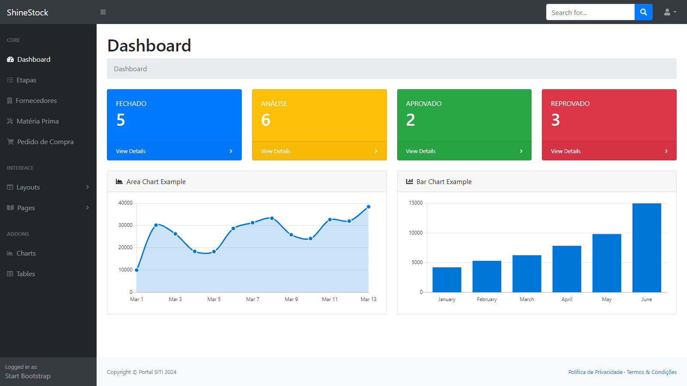
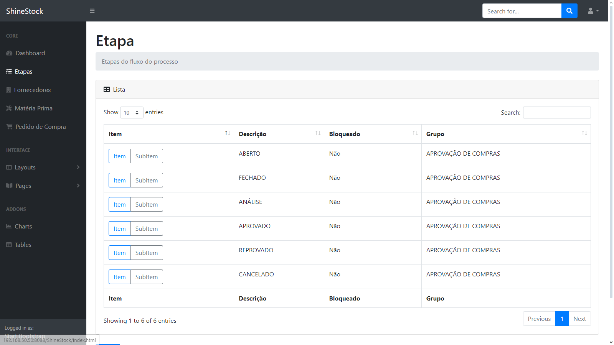
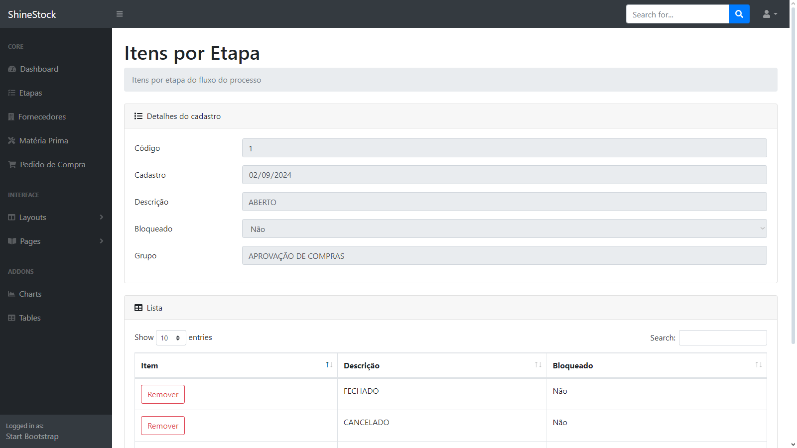
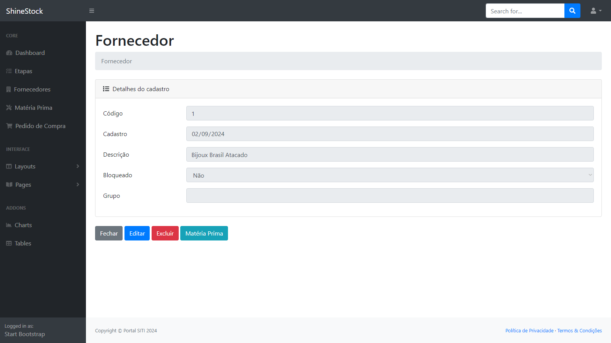
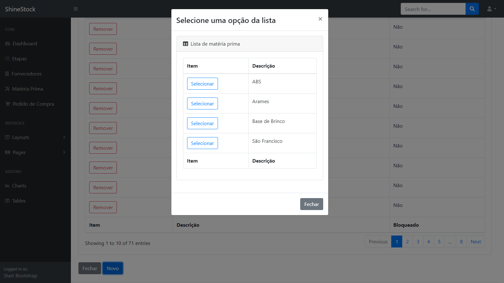
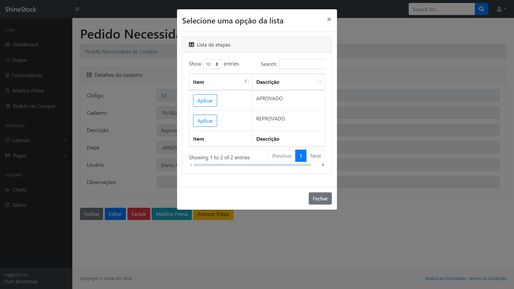

# ShineStock
 ### O estoque que faz sua produção brilhar.

Protótipo de sistema para almoxarifado.

## Protótipo Modelo de Software – ShineStock
Com a finalidade de apresentar a implementação de uma ou mais tecnologias, esta proposta não tem finalidade comercial.

## Descrição Geral
### Sistema de controle de estoque para almoxarifado com funcionalidades para:

Cadastro de matéria-prima e fornecedores.
Abertura de pedidos de compra com acompanhamento do status do fluxo operacional.

## Representação Operacional
Um sistema para controle de almoxarifado requer certa complexidade.
Neste protótipo, foi apresentado apenas um pequeno trecho do fluxo operacional de compra de matéria-prima.

A solução entregue neste protótipo permite a inclusão de um pedido de necessidade de compra e o acompanhamento das mudanças de status das aprovações.

Cenário:

O usuário Miguel criou um pedido de necessidade de compra de matéria-prima. No pedido de compra, ele informou nas observações que se trata de uma necessidade para atender ao "Lançamento Verão". Neste pedido, Miguel incluiu os suprimentos necessários para atender à reposição do estoque.

O pedido é criado com a etapa "ABERTO". Nesta etapa, é informado a todos os usuários que acessam o sistema que Miguel está editando o pedido e que ele ainda não o finalizou.

Ao finalizar a inclusão de todos os itens de matéria-prima em seu pedido de necessidade de compra, Miguel modifica para a etapa seguinte, que é "FECHADO".

Outro usuário, responsável por realizar as aprovações dos pedidos "FECHADOS", ou seja, aguardando aprovação, realiza a análise do conteúdo e decide por avançar a etapa, podendo ser "APROVADO" ou "REPROVADO".

As etapas são parametrizadas, podendo haver mais passos além dos já definidos.

[Ver Demonstra&ccedil;&atilde;o](http://shinestock.free.nf/ShineStock/Dashboard)

<table>
  <tr>
    <td>
      
    </td>
  </tr>
  <tr>
    <td>
      
    </td>
  </tr>
  <tr>
    <td>
      
    </td>
  </tr>
  <tr>
    <td>
      
    </td>
  </tr>
  <tr>
    <td>
      
    </td>
  </tr>
  <tr>
    <td>
      
    </td>
  </tr>
</table>

## Requisitos de Implementação
* Requer hospedagem de site em PHP.
* Requer hospedagem banco de dados MySQL.

## Cronograma
O desenvolvimento da solução requer o total de 40 horas.

## Suporte ao Produto
Esta proposta não tem valor comercial.

## Condições Gerais
Esta proposta não tem valor comercial.

## Considerações Finais
O sistema ora proposto é passível de expansão e adaptável às necessidades específicas da área de negócios do cliente. Logomarcas, fotos, ilustrações e textos, são de responsabilidade da contratante, devem ser apresentados dentro das datas negociadas de comum acordo entre as partes, para que possamos cumprir rigorosamente o cronograma de desenvolvimento e consequente entrega do projeto na data programada, constante neste documento.
